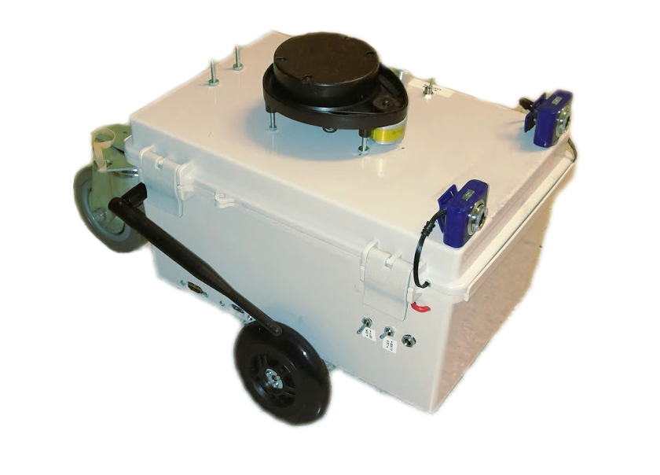

# Gunnar

  
  

  <em>
    Gunnar and a sample map generated with Gmapping.
  </em>

Gunnar is a differential-drive rover with LIDAR as its primary sense.
It uses Robot Operating System (ROS) to provide messaging between components,
and important algorithms such as particle filter
simultaneous localization and mapping (SLAM). 

To make the SD card:

1. Download and extract Raspbian Jessie image (e.g.
   `2016-05-27-raspbian-jessie.img`, which I torrented from raspberrypi.org;
   see `/data/`).
   
2. Create config script `makeconfig.mk`. Mine looks like this:

        IMGPATH = /home/tsbertalan/workspace/gunnar/2016-05-27-raspbian-jessie.img
        MNTPOINT = /mnt/img
        USER = pi
        SDX = /dev/sdc
   Here, the `MNTPOINT` is where the image will be mounted for modification,
   and the `USER` is the username to be used on that system (I don't know why
   it wouldn't be `pi`). THE `SDX` MUST BE THE SD CARD YOU WILL BE OVERWRITING.
   If you don't get this right, you might OVERWRITE YOUR INTERNAL HARD DRIVE
   with the Raspbian image.
   
3. Mount image, alter it to contain our backdoor, and unmount (script
   `mountAndAlterSD.sh`).
   
4. Write image (make targets `flash` and `verify`). This takes about 3 minutes
   on my machine, with a 32 GB Samsung
   
5. Insert SD into Raspberri Pi. Boot and wait for the script to install things
   and self-reboot. This sometimes takes more than an hour on my Pi 3B v1.2
   with 62 Mbps wifi download speeds, mostly in the
   "Unpacking libboost1.55-dev:armhf" stage. However, 20 minutes is a more
   likely duration.
   Monitor the process on the HDMI output--if there's an immediate kernel panic,
   reflash the card.
   Try using `tail -f /var/log/syslog | grep bootInstall` to monitor progress
   or diagnose errors.
   
6. If you're able to SSH in, test functionality by
   `roslaunch gunnar gunnar_hardware.launch`

Here's a video of Gunnar autonomously navigating to user-selected waypoints,
mapping along the way.
<iframe width="100%" height="400" src="https://www.youtube.com/embed/eSeLW9Hkjhc" frameborder="0" allowfullscreen></iframe>
